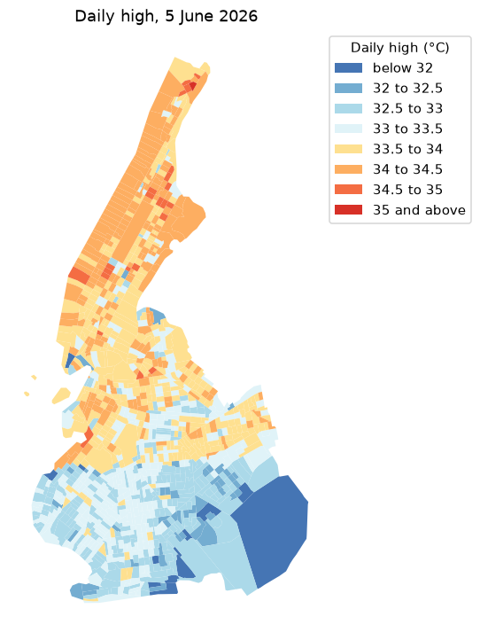
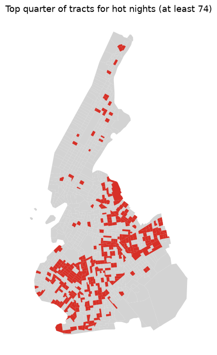
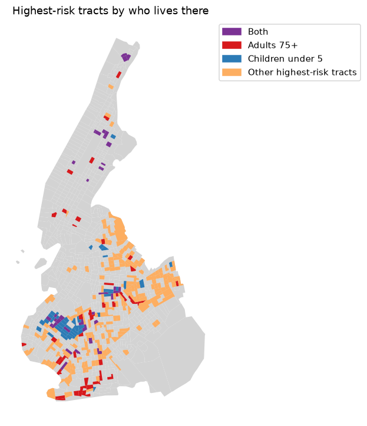

# HeatReady walkthrough: New York City by census tract

This walkthrough repeats the analyses from the HeatReady presentation with the Python or R client. It
starts with one hot day across Manhattan and Brooklyn, finds the census tracts where nights stayed hot
through the summer, and then looks at where adults 75 and older and children under 5 live within those
tracts. The last two steps bring in outside data and create a project from your own boundaries.

Every step runs against the live HeatReady API. The code comes in Python and R. Pick one language and
follow it through; the results are the same.

## Before you start

You need a HeatReady username and key. At a workshop, claim one at
[nishantkishore.com/workshop](https://nishantkishore.com/workshop) with the code from the slide.
Otherwise, write to [datascience_crisisready@harvard.edu](mailto:datascience_crisisready@harvard.edu).

Install the client and the packages this walkthrough uses.

```bash
# Python 3.10 or newer
pip install "git+https://github.com/crisisready/heat-ready-clients.git#subdirectory=python" geopandas matplotlib
```

```r install
# R 4.1 or newer, with dplyr 1.1 or newer (update.packages() if unsure)
install.packages(c("remotes", "sf", "tidyverse"))
remotes::install_github("crisisready/heat-ready-clients", subdir = "r")
```

The code reads your username and key from two environment variables, `HEATREADY_USERNAME` and
`HEATREADY_KEY`. The workshop page shows the exact lines to set them in a terminal, in Python, or in R.
Keep the key out of any file you plan to share.

## 1. Connect

`ping()` checks that your username and key work. The project for this walkthrough is
`nyc-manhattan-brooklyn-2026`, the 1,114 census tracts of Manhattan and Brooklyn. It is public, so any
HeatReady account can read it.

```python
import os
import numpy as np
import pandas as pd
import geopandas as gpd
import matplotlib.pyplot as plt
from matplotlib.colors import ListedColormap
from heatready import HeatReadyClient

client = HeatReadyClient(
    username=os.environ["HEATREADY_USERNAME"],
    key=os.environ["HEATREADY_KEY"],
)
print(client.ping())

PROJECT = "nyc-manhattan-brooklyn-2026"
status = client.get_project_status(PROJECT)
print(status["polygon_count"], "census tracts")
```

```r
library(tidyverse)
library(sf)
library(heatready)

client <- HeatReadyClient$new(
  username = Sys.getenv("HEATREADY_USERNAME"),
  key      = Sys.getenv("HEATREADY_KEY")
)
client$ping()

PROJECT <- "nyc-manhattan-brooklyn-2026"
status <- client$get_project_status(PROJECT)
cat(status$polygon_count, "census tracts\n")
```

The API does not return tract boundaries, so the shapes for mapping come from a file in this
repository. Each tract's `name` matches the name the API uses, and `neighborhood` is its New York City
Neighborhood Tabulation Area.

```python
TRACTS_URL = "https://raw.githubusercontent.com/crisisready/heat-ready-clients/main/walkthrough/data/nyc-tracts.geojson"
tracts = gpd.read_file(TRACTS_URL)
tracts.plot(color="lightgrey", edgecolor="white", linewidth=0.2, figsize=(6, 7)).set_axis_off()
```

```r
TRACTS_URL <- "https://raw.githubusercontent.com/crisisready/heat-ready-clients/main/walkthrough/data/nyc-tracts.geojson"
tracts <- read_sf(TRACTS_URL)
ggplot(tracts) + geom_sf(fill = "grey85", colour = "white", linewidth = 0.1) + theme_void()
```

## 2. One hot day, tract by tract

Each row from `iter_metrics()` is one tract on one local day. We pull 5 June 2026, the day the
presentation opens on.

Two values matter here. `day_t2m_max` is the daily high from the ERA5-Land grid, whose cells are about
9 km across. The `downscaled` block carries the same high after the HeatReady model adjusts it for the
tract's own surroundings, such as land cover, tree canopy, and elevation. Where a tract has no
adjustment, we keep the grid value.

```python
rows = list(client.iter_metrics(PROJECT, date_from="2026-06-05", date_to="2026-06-05"))

def tract_high(row):
    ds = row.get("downscaled") or {}
    return ds.get("metrics", {}).get("day_t2m_max", row["day_t2m_max"])

day = pd.DataFrame({
    "name": [r["name"] for r in rows],
    "grid_high": [r["day_t2m_max"] for r in rows],
    "tract_high": [tract_high(r) for r in rows],
})
print(day["grid_high"].round(2).nunique(), "distinct grid values")
print(day[["grid_high", "tract_high"]].quantile([0.05, 0.95]).round(1))
```

```r
rows <- client$iter_metrics(PROJECT, date_from = "2026-06-05", date_to = "2026-06-05")

day <- rows |>
  as_tibble() |>
  transmute(
    name,
    grid_high  = day_t2m_max,
    tract_high = map2_dbl(downscaled, day_t2m_max, \(ds, grid) ds$metrics$day_t2m_max %||% grid)
  )

day |> summarise(distinct_grid_values = n_distinct(round(grid_high, 2)))
day |> reframe(across(c(grid_high, tract_high), \(x) round(quantile(x, c(0.05, 0.95)), 1)))
```

The grid gives the two boroughs 6 different values, spread over 1.5 °C. Across the tracts, the high
runs from 32.4 to 34.3 °C between the 5th and 95th percentiles. The map below puts every tract in
fixed half-degree classes, so one colour always means the same temperature.

```python
BREAKS = [-np.inf, 32, 32.5, 33, 33.5, 34, 34.5, 35, np.inf]
LABELS = ["below 32", "32 to 32.5", "32.5 to 33", "33 to 33.5", "33.5 to 34", "34 to 34.5", "34.5 to 35", "35 and above"]
COLOURS = ["#4575b4", "#74add1", "#abd9e9", "#e0f3f8", "#fee090", "#fdae61", "#f46d43", "#d73027"]

hot_day = tracts.merge(day, on="name")
hot_day["class"] = pd.cut(hot_day["tract_high"], BREAKS, labels=LABELS)
ax = hot_day.plot(column="class", cmap=ListedColormap(COLOURS), legend=True, figsize=(7, 8),
                  legend_kwds={"title": "Daily high (°C)", "loc": "upper left", "bbox_to_anchor": (1, 1)})
ax.set_title("Daily high, 5 June 2026")
ax.set_axis_off()

print(hot_day.nlargest(5, "tract_high")[["neighborhood", "borough", "tract_high"]])
```

```r
BREAKS  <- c(-Inf, 32, 32.5, 33, 33.5, 34, 34.5, 35, Inf)
LABELS  <- c("below 32", "32 to 32.5", "32.5 to 33", "33 to 33.5", "33.5 to 34", "34 to 34.5", "34.5 to 35", "35 and above")
COLOURS <- c("#4575b4", "#74add1", "#abd9e9", "#e0f3f8", "#fee090", "#fdae61", "#f46d43", "#d73027")

hot_day <- tracts |>
  inner_join(day, by = "name") |>
  mutate(class = cut(tract_high, BREAKS, labels = LABELS))

ggplot(hot_day) +
  geom_sf(aes(fill = class), colour = NA) +
  scale_fill_manual(values = set_names(COLOURS, LABELS), drop = FALSE, name = "Daily high (\u00b0C)") +
  labs(title = "Daily high, 5 June 2026") +
  theme_void()

hot_day |>
  st_drop_geometry() |>
  slice_max(tract_high, n = 5, with_ties = FALSE) |>
  select(neighborhood, borough, tract_high)
```



The hottest tracts that afternoon were in Inwood and East Harlem, up to 2.6 °C above the grid cell
they sit in.

## 3. The highest-risk tracts: nights that stayed hot

The body recovers from a hot day after dark, so a night that stays warm carries the risk forward.
`get_nighttime_persistence()` counts, for each tract, the nights this season when the temperature
never fell below 20 °C. We call the top quarter of tracts on that count the highest-risk tracts, the
same cut the presentation uses.

```python
nights = client.get_nighttime_persistence(PROJECT)
hot_nights = pd.DataFrame({
    "name": list(nights["per_tract"]),
    "hot_nights": [t["no_relief_count_season"] for t in nights["per_tract"].values()],
    "nights_tracked": [t["n_nights_tracked"] for t in nights["per_tract"].values()],
})

risk = tracts.merge(hot_nights, on="name")
cutoff = risk["hot_nights"].quantile(0.75)
risk["highest_risk"] = risk["hot_nights"] >= cutoff
print("As of", nights["as_of_date"], "- cutoff:", cutoff, "hot nights")
print(risk["highest_risk"].sum(), "highest-risk tracts")
print(risk[risk["highest_risk"]]["neighborhood"].value_counts().head(6))

ax = risk.plot(color="lightgrey", figsize=(7, 8))
risk[risk["highest_risk"]].plot(ax=ax, color="#d73027")
ax.set_title(f"Top quarter of tracts for hot nights (at least {cutoff:.0f})")
ax.set_axis_off()
```

```r
nights <- client$get_nighttime_persistence(PROJECT)

hot_nights <- tibble(
  name           = names(nights$per_tract),
  hot_nights     = map_dbl(nights$per_tract, \(t) as.numeric(t$no_relief_count_season)),
  nights_tracked = map_dbl(nights$per_tract, \(t) as.numeric(t$n_nights_tracked))
)

risk <- tracts |> inner_join(hot_nights, by = "name")
cutoff <- quantile(risk$hot_nights, 0.75)
risk <- risk |> mutate(highest_risk = hot_nights >= cutoff)

cat("As of", nights$as_of_date, "- cutoff:", cutoff, "hot nights\n")
cat(sum(risk$highest_risk), "highest-risk tracts\n")
risk |>
  st_drop_geometry() |>
  filter(highest_risk) |>
  count(neighborhood, sort = TRUE) |>
  head(6)

ggplot(risk) +
  geom_sf(aes(fill = highest_risk), colour = NA) +
  scale_fill_manual(values = c(`FALSE` = "grey85", `TRUE` = "#d73027"), guide = "none") +
  labs(title = sprintf("Top quarter of tracts for hot nights (at least %.0f)", cutoff)) +
  theme_void()
```



On 28 September 2026, 311 tracts had at least 74 hot nights out of the 120 tracked since 1 June.
Many tracts share the same count, so the top quarter holds a few more than a quarter of the city. 284
of the 311 are in Brooklyn, with the most in Borough Park, Bensonhurst, and Brownsville. The count
updates every day, so a later run gives slightly different numbers.

## 4. Who lives in the highest-risk tracts

`get_vulnerability_data()` returns population by age group for each tract, from WorldPop. It
returns 500 tracts per call unless asked for more, so we set `limit` above the project's 1,114. We turn
the counts into people per square kilometre so small, dense tracts compare fairly with large ones.
Within the highest-risk tracts, we then take the top quarter for adults 75 and older and the top
quarter for children under 5.

```python
vuln = pd.DataFrame(client.get_vulnerability_data(PROJECT, limit=5000)["vulnerability"])
ages = vuln[["name", "pop_elderly_75plus", "pop_under5"]]

high = risk[risk["highest_risk"]].merge(ages, on="name")
high["area_km2"] = high.to_crs(6933).area / 1e6
high["older_per_km2"] = high["pop_elderly_75plus"] / high["area_km2"]
high["young_per_km2"] = high["pop_under5"] / high["area_km2"]

high["older"] = high["older_per_km2"] >= high["older_per_km2"].quantile(0.75)
high["young"] = high["young_per_km2"] >= high["young_per_km2"].quantile(0.75)
high["group"] = np.select(
    [high["older"] & high["young"], high["older"], high["young"]],
    ["Both", "Adults 75+", "Children under 5"],
    default="Other highest-risk tracts",
)
print(high["group"].value_counts())
print(high[high["group"] == "Both"].nlargest(5, "hot_nights")[["name", "neighborhood", "hot_nights"]])

GROUP_COLOURS = {"Both": "#7b3294", "Adults 75+": "#d7191c", "Children under 5": "#2c7bb6", "Other highest-risk tracts": "#fdae61"}
ax = risk.plot(color="lightgrey", figsize=(7, 8))
for group, colour in GROUP_COLOURS.items():
    high[high["group"] == group].plot(ax=ax, color=colour, label=group)
ax.legend(handles=[plt.Rectangle((0, 0), 1, 1, color=c) for c in GROUP_COLOURS.values()],
          labels=list(GROUP_COLOURS), loc="upper left", bbox_to_anchor=(1, 1))
ax.set_title("Highest-risk tracts by who lives there")
ax.set_axis_off()
```

```r
ages <- client$get_vulnerability_data(PROJECT, limit = 5000)$vulnerability |>
  as_tibble() |>
  select(name, pop_elderly_75plus, pop_under5)

GROUP_COLOURS <- c("Both" = "#7b3294", "Adults 75+" = "#d7191c", "Children under 5" = "#2c7bb6", "Other highest-risk tracts" = "#fdae61")

high <- risk |>
  filter(highest_risk) |>
  inner_join(ages, by = "name") |>
  mutate(
    area_km2      = as.numeric(st_area(st_transform(geometry, 6933))) / 1e6,
    older_per_km2 = pop_elderly_75plus / area_km2,
    young_per_km2 = pop_under5 / area_km2,
    older = older_per_km2 >= quantile(older_per_km2, 0.75, na.rm = TRUE),
    young = young_per_km2 >= quantile(young_per_km2, 0.75, na.rm = TRUE),
    group = case_when(
      older & young ~ "Both",
      older         ~ "Adults 75+",
      young         ~ "Children under 5",
      .default      = "Other highest-risk tracts"
    )
  )

high |> st_drop_geometry() |> count(group)
high |>
  st_drop_geometry() |>
  filter(group == "Both") |>
  slice_max(hot_nights, n = 5, with_ties = FALSE) |>
  select(name, neighborhood, hot_nights)

ggplot() +
  geom_sf(data = risk, fill = "grey85", colour = NA) +
  geom_sf(data = high, aes(fill = group), colour = NA) +
  scale_fill_manual(values = GROUP_COLOURS, breaks = names(GROUP_COLOURS), name = NULL) +
  labs(title = "Highest-risk tracts by who lives there") +
  theme_void()
```



Of the 311 highest-risk tracts, 78 are in the top quarter for adults 75 and older, 78 for children
under 5, and 36 for both. Census Tract 116 in Sunset Park, the tract the presentation follows, is one
of the 36 and has the most hot nights among them, 79.

Other age groups work the same way. `pop_elderly_65plus` gives adults 65 and older, and the `frac_`
columns give each group as a share of the tract's population.

## 5. Add your own data

The API covers heat and population. Much of what matters locally lives in other files. As an
example, NYC Aging publishes the location of every older adult center in the city on
[NYC Open Data](https://data.cityofnewyork.us/d/u7wp-np5k). A copy of the 301 centers sits in this
repository so the step works for a full room at once. We count the centers within 400 metres, about
a five-minute walk, of each highest-risk tract with many older residents.

```python
CENTERS_URL = "https://raw.githubusercontent.com/crisisready/heat-ready-clients/main/walkthrough/data/nyc-older-adult-centers.csv"
centers = pd.read_csv(CENTERS_URL)
centers = gpd.GeoDataFrame(centers, geometry=gpd.points_from_xy(centers["longitude"], centers["latitude"]), crs=4326)

older = high[high["older"]].to_crs(32618)
points = centers.to_crs(32618)
older["centers_400m"] = [int((points.distance(shape) <= 400).sum()) for shape in older.geometry]
print((older["centers_400m"] > 0).sum(), "of", len(older), "have a center within 400 m")
print(older[older["centers_400m"] == 0][["neighborhood", "hot_nights"]].sort_values("hot_nights", ascending=False))
```

```r
CENTERS_URL <- "https://raw.githubusercontent.com/crisisready/heat-ready-clients/main/walkthrough/data/nyc-older-adult-centers.csv"
centers <- read_csv(CENTERS_URL, show_col_types = FALSE) |>
  st_as_sf(coords = c("longitude", "latitude"), crs = 4326) |>
  st_transform(32618)

older <- high |>
  filter(older) |>
  st_transform(32618) |>
  mutate(centers_400m = lengths(st_is_within_distance(geometry, centers, dist = 400)))

cat(sum(older$centers_400m > 0), "of", nrow(older), "have a center within 400 m\n")
older |>
  st_drop_geometry() |>
  filter(centers_400m == 0) |>
  arrange(desc(hot_nights)) |>
  select(neighborhood, hot_nights)
```

57 of the 78 tracts have an older adult center within 400 metres. The other 21 are a natural first
list for outreach. The same pattern works for any file with coordinates or tract IDs, such
as clinics, cooling centers, schools, or your own survey sites.

## 6. Start your own project

A project starts from a GeoJSON FeatureCollection with one feature per area and a `name` property on
each feature. The name is how every result comes back, so use names people will recognize. Census
tracts, wards, districts, or shapes drawn by hand at [geojson.io](https://geojson.io) all work.

The example below makes a small project from three Sunset Park tracts. Swap in your own file and
project ID.

```python
import json
import time

my_areas = tracts[tracts["geoid"].isin(["36047011200", "36047011400", "36047011600"])]
my_areas = my_areas.assign(name=my_areas["neighborhood"] + " " + my_areas["geoid"].str[-6:])[["name", "geometry"]]
geojson = json.loads(my_areas.to_json())
# Or read your own file:  geojson = json.load(open("my_areas.geojson"))

MY_PROJECT = "my-first-project"
print(client.create_project(MY_PROJECT, geojson)["message"])

while not client.get_project_status(MY_PROJECT).get("start"):
    time.sleep(30)
print("Ready")

mine = pd.DataFrame(client.iter_metrics(MY_PROJECT))
print(mine[["name", "date", "day_t2m_max", "nighttime_t2m_min"]].tail())
```

```r
my_areas <- tracts |>
  filter(geoid %in% c("36047011200", "36047011400", "36047011600")) |>
  mutate(name = str_c(neighborhood, " ", str_sub(geoid, 6, 11))) |>
  select(name)
path <- tempfile(fileext = ".geojson")
st_write(my_areas, path, quiet = TRUE)
geojson <- jsonlite::read_json(path)
# Or read your own file:  geojson <- jsonlite::read_json("my_areas.geojson")

MY_PROJECT <- "my-first-project"
client$create_project(MY_PROJECT, geojson)$message

while (is.null(client$get_project_status(MY_PROJECT)$start)) Sys.sleep(30)
cat("Ready\n")

client$iter_metrics(MY_PROJECT) |>
  as_tibble() |>
  select(name, date, day_t2m_max, nighttime_t2m_min) |>
  tail()
```

A new project fills in within a few minutes. It starts with the last two weeks of daily heat metrics,
then adds age groups, land cover, and air quality shortly after. Steps 2 to 5 work the same way with
`PROJECT` set to your own ID, your own boundary file in place of the tract file, and a date from your
project's history in step 2. The hot-night count in step 3 grows by one night each day, and
`backfill_project()` adds up to 30 more days of history before the start date. The tract-level adjustment from step 2 is added by the daily update, which
runs at 06:00 UTC.

A workshop key stops working one week after it is claimed, and its projects are deleted then. To keep
them, make your account permanent at [nishantkishore.com/workshop](https://nishantkishore.com/workshop) before then.
The full list of API actions is in the
[API reference](https://github.com/crisisready/heat-risk-data-api/blob/main/docs/api.md).
